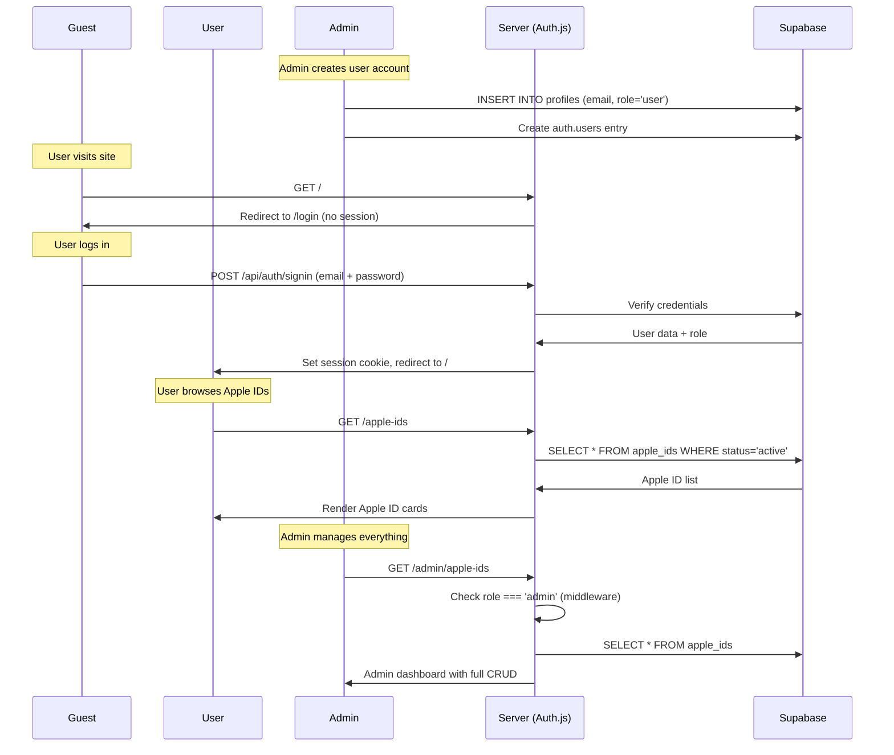

# 📋 HMA Website — Modern Rebuild Planning

> **Version**: 2.0 — Complete Redesign
> **Last Updated**: 2026-03-23
> **Core Concept**: Admin manages Apple ID accounts → Users login to view/use them

---

## 🎯 Site Purpose

Admin (Htet Myat Aung) က Free Apple ID account တွေကို ထည့်ပေးမယ်။ User တွေက Admin ဖွင့်ပေးထားတဲ့ account နဲ့ login ဝင်ပြီး Apple ID credential တွေကို ကြည့်ရှုပြီး copy ယူနိုင်မယ်။ Blog posts တွေလည်း ရေးနိုင်မယ် (iOS tutorials, tips).

---

## 🏗️ Tech Stack

| Layer | Technology | Purpose |
|-------|-----------|---------|
| **Framework** | Next.js 14+ (App Router) | SSR, routing, API routes |
| **UI** | React 18+ | Component-based UI |
| **Auth** | Auth.js v5 (NextAuth) | Login, session, role-based access |
| **Database** | Supabase (PostgreSQL) | All data storage |
| **Storage** | Supabase Storage | Image uploads |
| **Styling** | CSS Modules + CSS Variables | Design system |
| **Animation** | Framer Motion | Page transitions |
| **Deployment** | Vercel | Hosting |

---

## 👥 Role System

### Admin
- Apple ID accounts CRUD (Create, Read, Update, Delete)
- Blog posts CRUD
- User management (create accounts, ban/unban)
- Site settings (alerts, social links)
- Dashboard with analytics

### User (Created by Admin)
- Login with admin-created credentials
- View Apple ID list (email, password, country, status)
- Copy credentials to clipboard
- Read blog posts
- Report issues with Apple IDs

### Guest (Not logged in)
- See login page only
- Cannot access any content

---

## 📦 Database Schema (Supabase)

```sql
-- ═══════════════════════════════════════
-- PROFILES (extends Supabase Auth)
-- ═══════════════════════════════════════
CREATE TABLE profiles (
  id UUID PRIMARY KEY REFERENCES auth.users(id) ON DELETE CASCADE,
  email TEXT NOT NULL,
  display_name TEXT,
  avatar_url TEXT,
  role TEXT NOT NULL DEFAULT 'user'
    CHECK (role IN ('admin', 'user')),
  is_active BOOLEAN DEFAULT true,
  created_at TIMESTAMPTZ DEFAULT now(),
  updated_at TIMESTAMPTZ DEFAULT now()
);

-- ═══════════════════════════════════════
-- APPLE IDS (Core Feature)
-- ═══════════════════════════════════════
CREATE TABLE apple_ids (
  id UUID PRIMARY KEY DEFAULT gen_random_uuid(),
  email TEXT NOT NULL,
  password TEXT NOT NULL,
  country_code TEXT NOT NULL DEFAULT 'US',
  country_name TEXT NOT NULL DEFAULT 'United States',
  status TEXT NOT NULL DEFAULT 'active'
    CHECK (status IN ('active', 'in_use', 'expired', 'locked')),
  notes TEXT,                     -- Admin notes for users
  expires_at TIMESTAMPTZ,
  added_by UUID REFERENCES profiles(id),
  created_at TIMESTAMPTZ DEFAULT now(),
  updated_at TIMESTAMPTZ DEFAULT now()
);

-- ═══════════════════════════════════════
-- BLOG POSTS
-- ═══════════════════════════════════════
CREATE TABLE posts (
  id UUID PRIMARY KEY DEFAULT gen_random_uuid(),
  slug TEXT UNIQUE NOT NULL,
  title TEXT NOT NULL,
  content TEXT NOT NULL,
  excerpt TEXT,
  featured_image TEXT,
  author_id UUID REFERENCES profiles(id),
  is_published BOOLEAN DEFAULT false,
  view_count INTEGER DEFAULT 0,
  created_at TIMESTAMPTZ DEFAULT now(),
  updated_at TIMESTAMPTZ DEFAULT now()
);

-- ═══════════════════════════════════════
-- LABELS (for blog posts)
-- ═══════════════════════════════════════
CREATE TABLE labels (
  id UUID PRIMARY KEY DEFAULT gen_random_uuid(),
  name TEXT UNIQUE NOT NULL,
  slug TEXT UNIQUE NOT NULL
);

CREATE TABLE post_labels (
  post_id UUID REFERENCES posts(id) ON DELETE CASCADE,
  label_id UUID REFERENCES labels(id) ON DELETE CASCADE,
  PRIMARY KEY (post_id, label_id)
);

-- ═══════════════════════════════════════
-- APPLE ID REPORTS (User reports issues)
-- ═══════════════════════════════════════
CREATE TABLE apple_id_reports (
  id UUID PRIMARY KEY DEFAULT gen_random_uuid(),
  apple_id_ref UUID REFERENCES apple_ids(id) ON DELETE CASCADE,
  reported_by UUID REFERENCES profiles(id),
  issue_type TEXT NOT NULL
    CHECK (issue_type IN ('locked', 'wrong_password', 'expired', 'other')),
  description TEXT,
  is_resolved BOOLEAN DEFAULT false,
  created_at TIMESTAMPTZ DEFAULT now()
);

-- ═══════════════════════════════════════
-- SITE SETTINGS
-- ═══════════════════════════════════════
CREATE TABLE settings (
  key TEXT PRIMARY KEY,
  value JSONB NOT NULL,
  updated_at TIMESTAMPTZ DEFAULT now()
);

-- Default settings
INSERT INTO settings (key, value) VALUES
  ('site_name', '"HMA — Free Apple IDs"'),
  ('alert_banner', '{"text": "", "enabled": false}'),
  ('telegram_link', '"https://t.me/H_M_A_2026"'),
  ('social_links', '[
    {"name": "Telegram Channel", "url": "https://t.me/+HfqZrZMZWqQwYjM1"},
    {"name": "Facebook", "url": "https://www.facebook.com/share/1HLJjkapJ8/"}
  ]');
```

### Row Level Security
```sql
-- Apple IDs: only authenticated users can view, admin can manage
ALTER TABLE apple_ids ENABLE ROW LEVEL SECURITY;

CREATE POLICY "Auth users can view active IDs" ON apple_ids
  FOR SELECT USING (
    auth.uid() IS NOT NULL
    AND (status = 'active' OR auth.jwt() ->> 'role' = 'admin')
  );

CREATE POLICY "Admin can manage IDs" ON apple_ids
  FOR ALL USING (auth.jwt() ->> 'role' = 'admin');

-- Profiles: users can read their own, admin can manage all
ALTER TABLE profiles ENABLE ROW LEVEL SECURITY;

CREATE POLICY "Users can view own profile" ON profiles
  FOR SELECT USING (auth.uid() = id OR auth.jwt() ->> 'role' = 'admin');

CREATE POLICY "Admin manages profiles" ON profiles
  FOR ALL USING (auth.jwt() ->> 'role' = 'admin');
```

---

## 🔐 Auth Flow



---

## 📁 Project Structure

```
hma-website/
├── src/
│   ├── app/
│   │   ├── layout.tsx                 # Root layout, theme provider
│   │   ├── page.tsx                   # Homepage (redirect if no auth)
│   │   ├── login/page.tsx             # Login page
│   │   │
│   │   ├── (user)/                    # User-facing (requires auth)
│   │   │   ├── layout.tsx             # User layout: header + content
│   │   │   ├── apple-ids/page.tsx     # Apple ID listing
│   │   │   ├── apple-ids/[id]/page.tsx# Apple ID detail
│   │   │   ├── blog/page.tsx          # Blog post listing
│   │   │   ├── blog/[slug]/page.tsx   # Blog post detail
│   │   │   └── profile/page.tsx       # User profile
│   │   │
│   │   ├── admin/                     # Admin (requires admin role)
│   │   │   ├── layout.tsx             # Admin layout: sidebar + content
│   │   │   ├── page.tsx               # Dashboard
│   │   │   ├── apple-ids/
│   │   │   │   ├── page.tsx           # Manage Apple IDs (table)
│   │   │   │   └── [id]/page.tsx      # Edit Apple ID
│   │   │   ├── posts/
│   │   │   │   ├── page.tsx           # Manage posts
│   │   │   │   ├── new/page.tsx       # Create post
│   │   │   │   └── [id]/page.tsx      # Edit post
│   │   │   ├── users/page.tsx         # Manage users
│   │   │   ├── reports/page.tsx       # View Apple ID reports
│   │   │   └── settings/page.tsx      # Site settings
│   │   │
│   │   └── api/
│   │       └── auth/[...nextauth]/route.ts
│   │
│   ├── components/
│   │   ├── layout/
│   │   │   ├── Header.tsx             # User navigation header
│   │   │   ├── AdminSidebar.tsx       # Admin sidebar nav
│   │   │   ├── Footer.tsx
│   │   │   └── MobileDrawer.tsx
│   │   ├── apple-ids/
│   │   │   ├── AppleIdCard.tsx        # User-facing card
│   │   │   ├── AppleIdTable.tsx       # Admin table view
│   │   │   ├── AppleIdForm.tsx        # Add/Edit modal
│   │   │   └── CopyButton.tsx         # Copy credential button
│   │   ├── posts/
│   │   │   ├── PostCard.tsx
│   │   │   ├── PostGrid.tsx
│   │   │   └── PostEditor.tsx         # Rich text editor
│   │   ├── ui/
│   │   │   ├── GlassCard.tsx
│   │   │   ├── Button.tsx
│   │   │   ├── Badge.tsx
│   │   │   ├── Modal.tsx
│   │   │   ├── Input.tsx
│   │   │   ├── Select.tsx
│   │   │   ├── AlertBanner.tsx
│   │   │   ├── Skeleton.tsx
│   │   │   ├── EmptyState.tsx
│   │   │   ├── StatsCard.tsx
│   │   │   └── Avatar.tsx
│   │   └── auth/
│   │       ├── LoginForm.tsx
│   │       └── AuthGuard.tsx
│   │
│   ├── lib/
│   │   ├── supabase/
│   │   │   ├── client.ts              # Browser Supabase client
│   │   │   ├── server.ts              # Server Supabase client
│   │   │   └── types.ts               # Generated types
│   │   ├── auth.ts                    # Auth.js config
│   │   └── utils.ts                   # Helpers
│   │
│   └── styles/
│       ├── globals.css                # Design system tokens
│       ├── components.module.css      # Shared component styles
│       └── admin.module.css           # Admin-specific styles
│
├── supabase/
│   └── migrations/
│       └── 001_initial.sql            # Schema from planning.md
├── public/
│   └── images/
├── middleware.ts                       # Auth + role checking
├── .env.local
├── next.config.ts
└── package.json
```

---

## 🛡️ Middleware (Route Protection)

```typescript
// middleware.ts — Conceptual
export function middleware(request) {
  const session = getToken(request);
  const path = request.nextUrl.pathname;

  // Guest: redirect to login
  if (!session && path !== '/login') {
    return redirect('/login');
  }

  // Logged in user trying to access login
  if (session && path === '/login') {
    return redirect('/');
  }

  // Non-admin trying to access /admin/*
  if (path.startsWith('/admin') && session?.role !== 'admin') {
    return redirect('/');
  }
}
```

---

## 🔄 Feature List & Priority

### 🔴 High Priority (MVP)
- [ ] Auth system (login/logout, role check)
- [ ] Admin: Create user accounts
- [ ] Admin: Apple ID CRUD
- [ ] User: View Apple IDs (list + detail)
- [ ] User: Copy credentials
- [ ] Responsive design (mobile + desktop)

### 🟡 Medium Priority
- [ ] Blog post system (CRUD + reading)
- [ ] User: Report Apple ID issues
- [ ] Admin: Dashboard with stats
- [ ] Admin: View/resolve reports
- [ ] Dark/Light mode toggle
- [ ] Search Apple IDs

### 🟢 Low Priority
- [ ] Alert banner management
- [ ] Social links in footer
- [ ] Telegram floating button
- [ ] User profile editing
- [ ] Analytics (view counts)
- [ ] PWA support

---

## 🚀 Implementation Phases

### Phase 1: Foundation (2-3 days)
- Next.js project init
- Supabase setup + migrations
- Auth.js config
- Design system CSS
- Layout components (Header, Footer, Sidebar)
- Login page

### Phase 2: Apple ID System (2-3 days)
- Admin: Apple ID CRUD (form, table, delete)
- User: Apple ID listing page
- User: Apple ID detail with copy-to-clipboard
- Status badges (active/expired/locked)

### Phase 3: User Management (1-2 days)
- Admin: Create user accounts
- Admin: Ban/Unban users
- User: Profile page
- Auth middleware for role protection

### Phase 4: Blog System (2-3 days)
- Admin: Post editor (rich text)
- Admin: Post management table
- User: Blog listing + detail pages
- Labels/categories

### Phase 5: Polish & Deploy (1-2 days)
- Report system
- Settings management
- SEO (meta tags, OG images)
- Vercel deployment
- Mobile testing

---

## 🔧 Environment Variables

```env
# Supabase
NEXT_PUBLIC_SUPABASE_URL=https://xxx.supabase.co
NEXT_PUBLIC_SUPABASE_ANON_KEY=eyJ...
SUPABASE_SERVICE_ROLE_KEY=eyJ...

# Auth.js
NEXTAUTH_URL=http://localhost:3000
NEXTAUTH_SECRET=<random-32-char-string>
AUTH_SUPABASE_ID=<supabase-project-ref>
AUTH_SUPABASE_SECRET=<supabase-service-key>
```

---

## 📝 Session Notes

### 2026-03-23 — Initial Planning
- Analyzed original Blogger XML template (5244 lines)
- Decided to completely break away from old cyberpunk/neon design
- New direction: Clean, professional, Apple-inspired
- Core feature: Admin manages Apple IDs, Users consume them
- Tech: Next.js + React + Auth.js + Supabase
